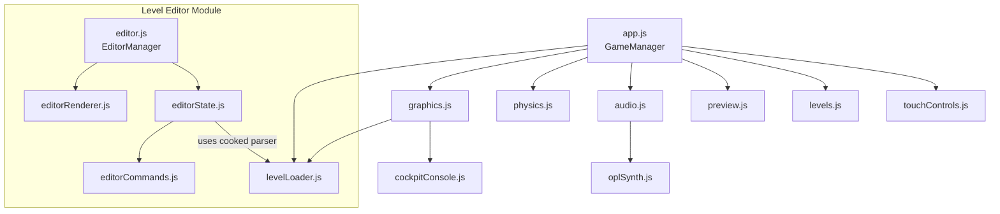

# 🚀 SkyRoads WebGL

A modern WebGL recreation of the classic 1993 DOS game **SkyRoads** by BlueMoon Interactive, rebuilt with Three.js, authentic OPL2 FM audio, and full mobile support.

**[▶ Play Live Demo](https://dascreed.github.io/space-paths/)**
**[🛠️ Open Level Editor](https://dascreed.github.io/space-paths/editor.html)**

---

## Features

### 🎮 Gameplay & Level Editor
- Faithful recreation of all 10 worlds from the original SkyRoads
- SkyRoads Xmas Special level pack included
- 30 procedurally generated levels (worlds 61–90) validated by a physics solver
- Sloped ramps with physics snapping and smooth tunnel transitions
- 6 tile effects: boost, slow, sticky, slippery, explosive, refill
- **🛠️ Integrated Level Editor:** Fully interactive 3D and 2D orthogonal editing viewports (Top, Front, Side views), 6 specialized drawing tools (Pen, Line, Fill, Marquee selection, Ramp-line, and Decal), gridlines for precise block alignment, dynamic track resizing (length/rows adjustments), and load/save support for both editor draft JSONs and compiled game levels.

### 🚢 Ships & Garage
- 6 ship classes with unique physics: Original, Fighter, Scout, Hauler, Dreadnought, Cruiser
- Spaceship Garage with 3D model preview, texture selector, and accent color picker
- Ship class selection with real-time physics tuning

### 🎨 Visual System
- 14 visual themes: Core, Cyberpunk, Industrial, Organic, Alien, Furnace, Glitch, Pulse, Ridge, Shallows, Spire, Thrill, Tundra, Void
- Procedural skybox with stars, nebulae, and planets
- 3D cockpit HUD with real-time gauges and LCD readouts
- Corner minimap path scanner
- Particle effects (exhaust, explosions, sparks)
- Glassmorphism UI with retro-futuristic design

### 🎵 Audio
- OPL2 FM synthesizer emulating the Yamaha YM3812 chip
- Original 1993 SkyRoads sound assets (MUZAX.LZS, SFX.SND)
- Retro 8-bit chiptune music mode
- Independent music and SFX volume controls
- Procedural engine hum reactive to speed

### 🕹️ Controls
- **Keyboard:** WASD/Arrow keys, Space (jump), Shift (brake)
- **Xbox Gamepad:** Full support with configurable button remapping
- **Touch:** Virtual analog stick, D-pad mode, throttle axis, drag-to-reposition customizer
- Autolane magnetic snapping for mobile
- Fullscreen mode

### 🔧 Developer & Automation Tools
- Automated visual playtest pipeline (Puppeteer screenshots)
- 25 test files with comprehensive coverage (Vitest + jsdom + Playwright)
- Real-time diagnostic hooks and events (`window.__editorDebug`) for visual and testing automation
- ComfyUI/Trellis2 asset generation pipeline
- GitHub Pages auto-deployment

---

## Quick Start

```bash
# Prerequisites: Node.js 20+

# Install dependencies
npm install

# Start development server
npm run dev

# Run tests
npm test

# Build for production
npm run build
```

---

## Controls

### Keyboard
| Key | Action |
|-----|--------|
| `W` / `↑` | Accelerate |
| `S` / `↓` | Brake |
| `A` / `←` | Steer Left |
| `D` / `→` | Steer Right |
| `Space` | Jump |
| `Shift` | Brake |
| `Esc` | Pause |
| `C` | Cycle Camera |

### Xbox Gamepad
- Left stick / D-pad for steering
- A = Jump, B = Brake, RT = Accelerate
- Fully remappable in Settings → Gamepad Config

### Mobile Touch
- Virtual analog stick or D-pad (configurable)
- Throttle axis (joystick Y-axis)
- Tap-to-jump and brake buttons
- All controls draggable via Touch Customizer

---

## Architecture

| Module | Size | Responsibility |
|--------|------|----------------|
| [app.js](docs/module-map.md#appjs) | 111 KB | GameManager — state machine, UI, game loop |
| [graphics.js](docs/module-map.md#graphicsjs) | 93 KB | Three.js rendering, particles, skybox |
| [levelLoader.js](docs/module-map.md#levelloaderjs) | 88 KB | Level geometry builder, themed textures |
| [editor.js](docs/module-map.md#editorjs) | 65 KB | Level Editor — page orchestrator, UI listeners, customizer |
| [worldBuilder.js](docs/module-map.md#worldbuilderjs) | 50 KB | Procedural level generation |
| [physics.js](docs/module-map.md#physicsjs) | 42 KB | Physics engine, ship classes |
| [audio.js](docs/module-map.md#audiojs) | 41 KB | Audio system, OPL2 FM synthesis |
| [editorRenderer.js](docs/module-map.md#editorrendererjs) | 35 KB | 3D + 2D orthogonal camera layout viewports renderer |
| [cockpitConsole.js](docs/module-map.md#cockpitconsolejs) | 35 KB | 3D cockpit HUD, minimap |
| [touchControls.js](docs/module-map.md#touchcontrolsjs) | 24 KB | Touch input manager — individual button system |
| [preview.js](docs/module-map.md#previewjs) | 23 KB | Ship garage preview |
| [oplSynth.js](docs/module-map.md#oplsynthjs) | 19 KB | OPL2 FM synthesis engine |
| [generate_textures.js](docs/module-map.md#generate_texturesjs) | 18 KB | Procedural texture generation |
| [editorState.js](docs/module-map.md#editorstatejs) | 17 KB | Editor document state, undo/redo manager, level translation |
| [editorCommands.js](docs/module-map.md#editorcommandsjs) | 6 KB | Drawing, Fill, Marquee and Resize command implementations |



---

## Documentation

| Document | Description |
|----------|-------------|
| [Module Map](docs/module-map.md) | Complete code map with all exports and dependencies |
| [Architecture](docs/architecture.md) | System design, state machines, data flow diagrams |
| [Asset Pipeline](docs/asset-generation-pipeline.md) | ComfyUI/Trellis2 3D model and texture generation |
| [Trellis2 Guide](docs/trellis_pixal3d_workflow_guide.md) | Detailed ComfyUI workflow setup and configuration |
| [Code Review](docs/code_review_report.md) | Code quality assessment and refactoring recommendations |

---

## Tech Stack

| Component | Technology |
|-----------|------------|
| 3D Engine | [Three.js](https://threejs.org/) ^0.175.0 |
| Build Tool | [Vite](https://vitejs.dev/) ^6.3.5 |
| Test Runner | [Vitest](https://vitest.dev/) ^3.1.4 |
| DOM Mock | [jsdom](https://github.com/jsdom/jsdom) ^26.1.0 |
| Audio | Web Audio API + OPL2 FM |
| Fonts | [Orbitron](https://fonts.google.com/specimen/Orbitron), [Outfit](https://fonts.google.com/specimen/Outfit) |
| Deploy | GitHub Pages + GitHub Actions |
| Asset Gen | ComfyUI, Trellis2, Pixal3D, Blender |

---

## Level Packs

| Pack | Levels | Source |
|------|--------|--------|
| Standard | 31 | Original 1993 DOS SkyRoads |
| Xmas Special | 31 | SkyRoads Xmas Special |
| Generated | 30 | Procedural generation with physics solver validation |

---

## License

MIT
