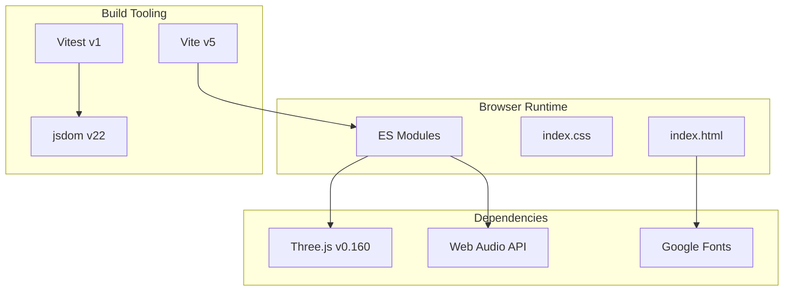
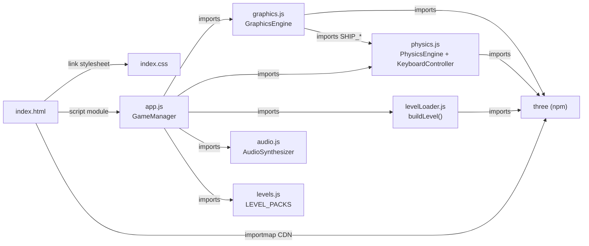
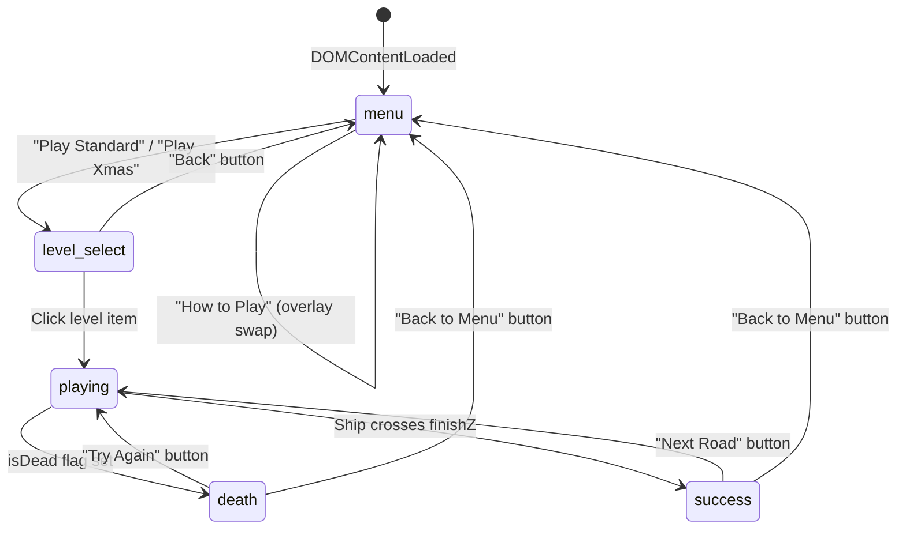
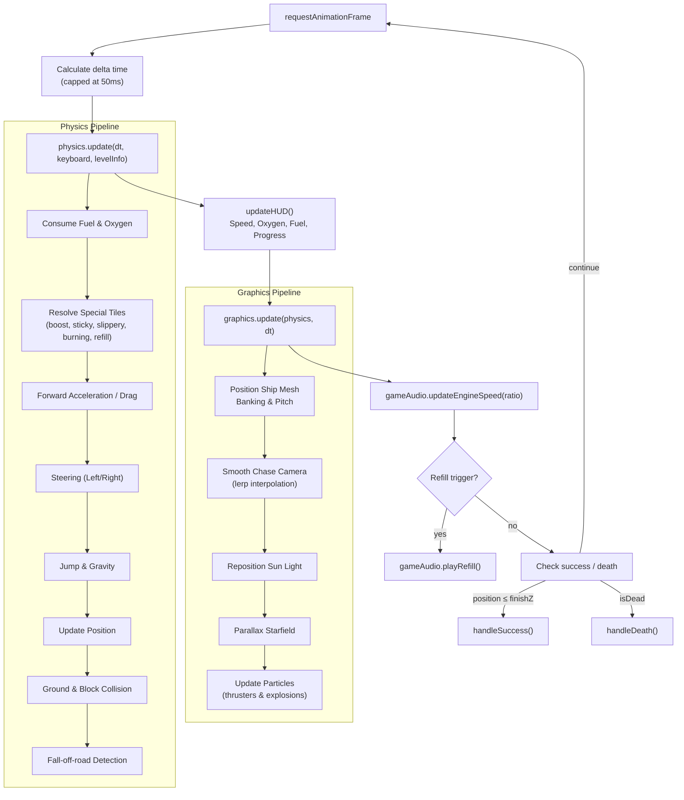
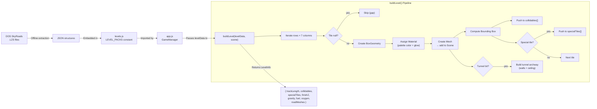

# SkyRoads WebGL — Architecture Overview

> A modern 3D WebGL remake of the classic 1993 DOS game SkyRoads, built with Three.js and vanilla JavaScript.

---

## Project Overview

| Attribute       | Value                                                          |
|-----------------|----------------------------------------------------------------|
| **Project**     | SkyRoads Modern WebGL Remake                                   |
| **Runtime**     | Browser (ES Modules)                                           |
| **3D Engine**   | [Three.js](https://threejs.org/) v0.160.0                      |
| **Audio**       | Web Audio API (procedural synthesis, plus classic OPL2/DOS assets) |
| **Build Tool**  | [Vite](https://vitejs.dev/) v5.x                               |
| **Test Runner** | [Vitest](https://vitest.dev/) v1.x (jsdom environment)        |
| **Package**     | `skyroads-modern` v1.0.0 (private, ESM)                       |
| **Fonts**       | Google Fonts — Orbitron (display), Outfit (body)               |
| **Level Data**  | Lazy-loaded JSON files fetched on demand (~6 MB standard and xmas packs) |

### Tech Stack Diagram



---

## Module Dependency Graph

The application follows a **hub-and-spoke** architecture where [app.js](file:///c:/dev/Sky%20roads/app.js) acts as the central orchestrator importing all subsystems.



> [!NOTE]
> `audio.js` imports OPL2 FM synthesizer and LZS decompression modules from `./oplSynth.js`.
> `levels.js` has **no** imports — it is a pure data module.

---

## GameManager State Machine

The [GameManager](file:///c:/dev/Sky%20roads/app.js#L8-L327) class in `app.js` implements a finite state machine with five states:



### State Responsibilities

| State          | Active Screen        | Game Loop Behavior                          | Audio State       |
|----------------|----------------------|---------------------------------------------|--------------------|
| `menu`         | `menu-screen`        | Stars rotate slowly, renderer active         | Engine stopped     |
| `level_select` | `level-screen`       | Stars rotate slowly, renderer active         | Engine stopped     |
| `playing`      | HUD visible          | Full physics + graphics update loop          | Engine hum running |
| `death`        | `death-screen` (1.2s delay) | Explosion particles, physics frozen   | Explosion SFX      |
| `success`      | `success-screen`     | Physics frozen, scene visible                | Win fanfare SFX    |

---

## Game Loop Data Flow

The main [animate()](file:///c:/dev/Sky%20roads/app.js#L211-L253) loop runs via `requestAnimationFrame` at display refresh rate. During `playing` state, each frame executes this pipeline:



### Menu Loop (non-playing states)

When not in `playing` state, the animate loop only:
1. Rotates the starfield slowly (`starField.rotation.y += 0.02 * dt`)
2. Calls `graphics.render()` to paint the scene

---

## Level Data Pipeline

Level data originates from the original 1993 DOS SkyRoads `.LZS` compressed road files, extracted offline into JSON and embedded in [levels.js](file:///c:/dev/Sky%20roads/levels.js).



### Level Data Schema

```
LEVEL_PACKS = {
  "standard": [ LevelData, ... ],   // 31 levels (index 0–30)
  "xmas":     [ LevelData, ... ]     // 31 levels (index 0–30)
}

LevelData = {
  level_index: number,
  gravity:     number,        // DOS gravity scale (e.g. 8 → mapped to 24 m/s²)
  fuel:        number,        // Starting fuel (e.g. 130 → scaled ×50 = 6500)
  oxygen:      number,        // Starting oxygen percentage (e.g. 60)
  palette:     [r,g,b][],     // 16+ color entries, values 0–255
  rows:        (Tile|null)[][]  // Array of rows, each row has 7 columns
}

Tile = {
  val:          number,
  full:         boolean,      // Full-height obstacle flag
  half:         boolean,      // Half-height obstacle flag
  tunnel:       boolean,      // Tunnel/archway overlay
  top_color:    number,       // Palette index for top face (determines behavior)
  bottom_color: number,       // Palette index for bottom/sides
  low3:         number        // Low 3 bits of raw tile value
}
```

---

## File Responsibility Table

| File | Lines | Size | Responsibility |
|------|------:|-----:|----------------|
| [app.js](file:///c:/dev/Sky%20roads/app.js) | 1,487 | 64 KB | Game orchestrator, state machine, UI event wiring, HUD updates, touch control mapping, physics calibrator dashboard, infinite road seamless transition manager, game loop |
| [graphics.js](file:///c:/dev/Sky%20roads/graphics.js) | 1,675 | 71 KB | Three.js renderer, scene setup, ship mesh, skybox, particles, chase camera, volumetric fragment shaders, city scenery spawners, custom procedural space/nebula particle systems |
| [physics.js](file:///c:/dev/Sky%20roads/physics.js) | 729 | 27 KB | Three-axis motion integration, collision detection, fuel/oxygen, special tiles terrain effects, keyboard input, settings calibrator parameters, coyote-time buffers, collision/bounce behaviors, sloped ramp snapping/side collisions, tunnel entrance transition overrides |
| [levelLoader.js](file:///c:/dev/Sky%20roads/levelLoader.js) | 1,404 | 52 KB | Asynchronous geometry compilation, BoxGeometry/rounded archways, palette mappings, finish neon arches, gap/tunnel mesh optimizations, custom triangular wedge geometry generator (`createRampGeometry`), level parser ramp pre-processing scanner |
| [audio.js](file:///c:/dev/Sky%20roads/audio.js) | 1,060 | 35 KB | Procedural sound synthesis via Web Audio API, speed-modulated engine hum, jump sweeps, and background synthesizer music playback. Manages sound effect triggers and sound mode selection (Synth vs. Classic). |
| [oplSynth.js](file:///c:/dev/Sky%20roads/oplSynth.js) | 631 | 19 KB | Real-time 15-channel OPL2 AdLib FM synthesis engine, DOS LZS decompressor stream parser, and Muzax / SFX sound structure decoders. |
| [levels.js](file:///c:/dev/Sky%20roads/levels.js) | 76 | 2 KB | Lazy-loading level pack manifest & caching utility to dynamically load `./data/standard_levels.json` and `./data/xmas_levels.json` without bloating initial page loads |
| [index.html](file:///c:/dev/Sky%20roads/index.html) | 641 | 37 KB | DOM structure: canvas container, HUD overlays, unified next-gen touch controls (left 2D analog stick, right arced action buttons), settings popups with calibration sliders, level select buttons |
| [index.css](file:///c:/dev/Sky%20roads/index.css) | 1,869 | 49 KB | Synthwave design system: glassmorphic styles, neon glow micro-animations, full-scale layouts, landscape/portrait media query scaling, PS2-style circular virtual joystick, and right-side arced button layouts |
| [vite.config.js](file:///c:/dev/Sky%20roads/vite.config.js) | 17 | 325 B | Dev server (port 3000, auto-open), build (esbuild minify), test (jsdom) |
| [package.json](file:///c:/dev/Sky%20roads/package.json) | 21 | 361 B | Package manifest, scripts: `dev`, `build`, `preview`, `test` |

---

## Key Design Decisions

### 1. Hub-and-Spoke Architecture (No Framework)

The project deliberately avoids SPA frameworks. `app.js` serves as a thin orchestrator wiring together three independent engines (graphics, physics, audio) plus a pure data module. This keeps the dependency graph flat and each module testable in isolation.

### 2. Dynamic Lazy Loading of Level Data

All level pack files (~6.3 MB JSON data) are dynamically lazy-loaded via `fetch` when starting standard or xmas level packs. The `levels.js` module exposes an asynchronous `loadLevelPack(packName)` function that caches data once fetched. This reduces the initial JS bundle size from 6MB+ to just ~2KB, ensuring fast loading and saving initial network bandwidth.

### 3. Dual-Mode Audio System: Procedural & Classic FM Emulation

The audio engine features a dual-mode sound system selectable in Settings:
1. **Synth Mode**: Generates all sound effects (jump sweeps, engine rumble, refills, crashes) and chiptune loops on-the-fly using browser oscillators, filters, noise nodes, and ADSR gain envelopes.
2. **Classic Mode**: Fetches original DOS assets (`MUZAX.LZS`, `SFX.SND`, `INTRO.SND`) dynamically. A client-side LZSS decompressor decodes these binary resources in the browser, extracting raw 8kHz 8-bit unsigned PCM sound effects and FM registers. A custom 15-channel OPL2 AdLib FM software synthesizer (`OplSynthJS`) emulates AdLib FM registers, scheduling notes and outputting samples directly to a Web Audio `ScriptProcessorNode` to reproduce the authentic 1993 game soundtrack.
If DOS asset fetches fail (e.g. in offline environments or JSDOM test runners), the engine gracefully falls back to Synth Mode to prevent breakage.

### 4. Global Window State for Cross-Module Communication

`physics.js` reads `window.currentLevelData`, `window.currentGamePack`, and `window.currentLevelIndex` for gap detection in [checkTileExists()](file:///c:/dev/Sky%20roads/physics.js#L266-L290). These globals are set by `app.js` in [startLevel()](file:///c:/dev/Sky%20roads/app.js#L166-L169). This avoids circular imports but introduces implicit coupling.

### 5. AABB Collision System

Physics uses axis-aligned bounding boxes (AABBs) for all collision detection. Both the ship and every tile/obstacle are represented as simple min/max boxes, enabling fast overlap checks without complex mesh-based collision.

### 6. Chase Camera with Lerp Interpolation

The camera smoothly follows the ship using `Vector3.lerp()` with a fixed blending factor (0.1), creating a cinematic chase-cam effect. The starfield and synthwave sun track the ship position to maintain the illusion of infinite space.

### 7. Tile Color → Behavior Mapping

Special tile behaviors (boost, sticky, slippery, burning, refill) are determined by the `top_color` palette index from the original DOS data, preserving compatibility with the original game's level design:

| `top_color` | Behavior   | Visual Effect        |
|:-----------:|------------|----------------------|
| 3           | Sticky     | Dark green glow      |
| 9           | Slippery   | Dark gray glow       |
| 10          | Refill     | Bright blue neon     |
| 11          | Boost      | Lime green neon      |
| 13          | Burning    | Bright red neon      |

### 8. CSS Design System with Custom Properties

The UI uses a synthwave/cyberpunk aesthetic defined through CSS custom properties (`:root` variables) for colors, fonts, and neon shadow effects. Glassmorphism cards (`backdrop-filter: blur`) overlay the 3D viewport.

### 9. Unified Premium Analog Stick HUD & Smart Snapping

To support mobile play, a high-fidelity glassmorphic overlay is injected dynamically with a unified controller configuration:
- **PS2-Style Virtual Analog Stick**: Left on-screen 2D floating joystick tracking continuous pointer displacement with concentric rubber-style ridges, an inner grip dome, and active neon highlights.
- **Right-Hand Arced Controls**: Curved action cluster for Thrust, Jump, and Brake buttons matching the thumb sweep of the player.
- **Smart Lane-Snapping Magnetism**: A proportional spring-damping alignment system in the physics loop that centers the ship onto the nearest track lane center if the steering stick is in deadzone/released.
Controls utilize multi-touch (`touchstart`, `touchend`, pointer capture) to guarantee zero latency and simultaneous button presses.

### 10. Seamless Level Stitching (Infinite Road Mode)

In infinite road mode, the game loops through levels seamlessly by stitching the track ahead. The orchestrator tracks a `this.infiniteZOffset` corresponding to the finish line of the current road. Mid-way through the autopilot transition, `buildLevelAsync` is triggered ahead, and obsolete Three.js meshes are cleanly deleted/disposed from memory to avoid resource leaks.

### 11. Physics Parameter Calibrator settings

An interactive settings popup exposes real-time slider controls for fine-tuning game constants such as forward speed, boost velocity, steering inertia, wall collision bounce/pushback, coyote-time buffers, and landing bounce height. This eliminates the default floating sensation and lets players customize responsiveness.

### 12. Sloped Ramps and Interpolated Snapping

To support vertical gameplay and ramps leading into elevated tunnels, the level parser pre-processes loaded levels to automatically scan for raised blocks carrying a tunnel, inserting a customized 3D triangular wedge (prism) immediately preceding the tunnel entrance.
- **Height Interpolation**: The physics loop calculates the ship's longitudinal progression ratio `t` along the ramp's Z-span and snaps the ship's Y position to the exact sloped `rampHeight = startY + t * (endY - startY)`.
- **Collision Priorities**: Side collisions (`Math.abs(position.x - blockCenterX) > 0.35`) are evaluated before height snapping to ensure that steering into the side of a ramp blocks the ship, while front collisions are ignored when climbing the ramp (`isOnRamp`) to prevent the ship's nose from crashing/rebounding into the elevated block immediately following it.
