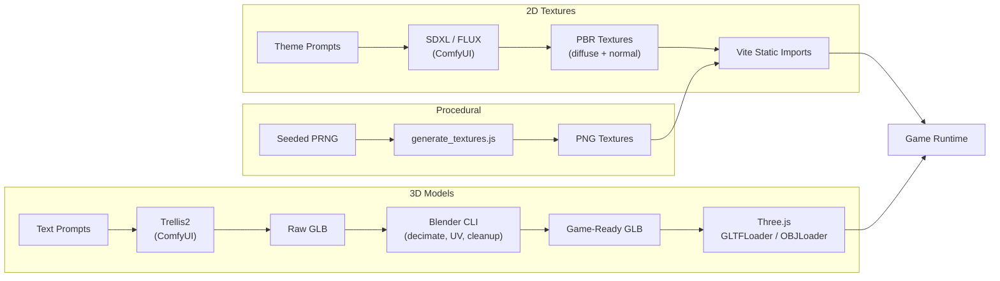

# SkyRoads WebGL — Asset Generation Pipeline

> **Last updated:** 2026-06-04
> Comprehensive documentation of the multi-tool asset generation pipeline.

---

## Pipeline Overview



---

## 3D Model Assets

### OBJ Source Models (`assets/models/`)

| Model | File | Size | Lines | Description |
|-------|------|------|-------|-------------|
| Fighter | [fighter.obj](file:///c:/dev/Sky%20roads/assets/models/fighter.obj) | 32 KB | 1,166 | Fast, agile fighter-class spaceship |
| Hauler | [hauler.obj](file:///c:/dev/Sky%20roads/assets/models/hauler.obj) | 28 KB | 1,034 | Heavy cargo hauler |
| Scout | [scout.obj](file:///c:/dev/Sky%20roads/assets/models/scout.obj) | 25 KB | 906 | Lightweight scout vessel |
| Dreadnought | [dreadnought.obj](file:///c:/dev/Sky%20roads/assets/models/dreadnought.obj) | 39 KB | 1,430 | Massive warship |
| Cruiser | [cruiser.obj](file:///c:/dev/Sky%20roads/assets/models/cruiser.obj) | 28 KB | 1,034 | Balanced cruiser |
| Tunnel Archway | [tunnel_archway.obj](file:///c:/dev/Sky%20roads/assets/models/tunnel_archway.obj) | 63 KB | 2,274 | Tunnel entrance geometry |

### GLB Exports (`assets/custom/`)

| Model | Description |
|-------|-------------|
| `fighter.glb` | Fighter ship (GLB format, optimized) |
| `hauler.glb` | Hauler ship (GLB format) |
| `scout.glb` | Scout ship (GLB format) |
| `dreadnought.glb` | Dreadnought ship (GLB format) |
| `racer.glb` | Racer ship (~12 MB, high-detail primary model) |
| `tunnel_archway.glb` | Tunnel archway (GLB format) |

### Blender Source Files (`assets/`)

| File | Purpose |
|------|---------|
| `ship.blend` | Base ship model |
| `ship_final.blend` | Final refined ship |
| `ship_game.blend` | Game-optimized version |
| `ship_symmetrized.blend` | Symmetrized variant |
| `ship_cleaned.glb` | Cleaned export |
| `ship_final.glb` | Final export |
| `ship_game.glb` | Game export |

### Blender Scripts

| Script | Purpose |
|--------|---------|
| `assets/decimate_fix.py` | Mesh decimation for poly count reduction |
| `assets/blender_cleanup.py` | Model cleanup, remove non-manifold geometry |

---

## 2D Texture System

### Theme Overview (14 Themes)

| # | Theme | Style | Assets |
|---|-------|-------|--------|
| 1 | `core` | Default base | road, obstacle, tunnel × diffuse+normal |
| 2 | `cyberpunk` | Neon-lit city | road, obstacle, tunnel × diffuse+normal |
| 3 | `industrial` | Heavy metal | road, obstacle, tunnel × diffuse+normal |
| 4 | `organic` | Bio-mechanical | road, obstacle, tunnel × diffuse+normal |
| 5 | `alien` | Extraterrestrial | road, obstacle, tunnel × diffuse+normal |
| 6 | `furnace` | Volcanic, molten | road, obstacle, tunnel × diffuse+normal |
| 7 | `glitch` | Digital corruption | road, obstacle, tunnel × diffuse+normal |
| 8 | `pulse` | Energy waves | road, obstacle, tunnel × diffuse+normal |
| 9 | `ridge` | Rocky terrain | road, obstacle, tunnel × diffuse+normal |
| 10 | `shallows` | Underwater | road, obstacle, tunnel × diffuse+normal |
| 11 | `spire` | Crystal towers | road, obstacle, tunnel × diffuse+normal |
| 12 | `thrill` | High-speed racing | road, obstacle, tunnel × diffuse+normal |
| 13 | `tundra` | Frozen landscape | road, obstacle, tunnel × diffuse+normal |
| 14 | `void` | Dark space | road, obstacle, tunnel × diffuse+normal |

### Naming Conventions

Textures follow two naming patterns (both exist for backward compatibility):

```
Primary:   {theme}_{type}_{map}.png
Secondary: {type}_{map}_{theme}.png

Examples:
  cyberpunk_road_diffuse.png     (primary)
  road_diffuse_cyberpunk.png     (secondary)
  cyberpunk_road_normal.png      (primary)
  road_normal_cyberpunk.png      (secondary)
```

Where:
- `{theme}` = one of 14 theme names
- `{type}` = `road`, `obstacle`, `tunnel`
- `{map}` = `diffuse`, `normal`

### Decal System (6 Types × 15 Variants = 90 Files)

| Decal Type | Effect | Base File | Themed Variants |
|------------|--------|-----------|-----------------|
| `boost` | Speed increase | `decal_boost.png` | `decal_boost_{theme}.png` × 14 |
| `slow` | Speed decrease | `decal_slow.png` | `decal_slow_{theme}.png` × 14 |
| `explosive` | Instant death | `decal_explosive.png` | `decal_explosive_{theme}.png` × 14 |
| `refill` | Fuel restore | `decal_refill.png` | `decal_refill_{theme}.png` × 14 |
| `sticky` | Steering reduction | `decal_sticky.png` | `decal_sticky_{theme}.png` × 14 |
| `slippery` | Steering amplification | `decal_slippery.png` | `decal_slippery_{theme}.png` × 14 |

---

## Procedural Textures

### generate_textures.js

[generate_textures.js](file:///c:/dev/Sky%20roads/generate_textures.js) is a standalone Node.js script that creates seamless 1024×1024 PNG textures from pure math:

| Output | Description |
|--------|-------------|
| `road_metallic_plate.png` | Dark industrial road surface with staggered panels, rivets, tread patterns |
| `spaceship_hull_plating.png` | Titanium hull plating with asymmetric panels, scratches, rivets |

**How it works:**
1. Seeded PRNG (Mulberry32) for deterministic output
2. Raw PNG encoding with CRC32 + zlib compression
3. No image library dependencies — pure math → pixel → PNG

---

## Per-Level Assets

30 per-level directories for procedurally generated levels:

```
assets/custom/
├── level_61/
├── level_62/
├── ...
└── level_90/
```

Each directory contains level-specific custom assets (themed textures tuned for that specific level).

---

## ComfyUI / Trellis2 Pipeline

### Infrastructure

- **ComfyUI** — Node-based workflow editor for AI image/3D generation
- **Trellis2** — 3D mesh generation from text/image prompts
- **Pixal3D** — PBR texture generation for 3D meshes
- **SDXL / FLUX** — 2D texture generation with seamless tiling

### Workflow Files

Located in [docs/comfyui-workflows/](file:///c:/dev/Sky%20roads/docs/comfyui-workflows):

| Workflow | Purpose |
|----------|---------|
| `trellis2_mesh_only_high_quality.json` | High-quality mesh generation only |
| `trellis2_mesh_with_texturing_pixal3d.json` | Mesh + PBR texturing pipeline |

### Detailed Guide

See [trellis_pixal3d_workflow_guide.md](file:///c:/dev/Sky%20roads/docs/trellis_pixal3d_workflow_guide.md) for:
- Local Trellis/Pixal3D setup instructions
- CUDA/Python dependency installation
- Weight file and checkpoint paths
- Low-VRAM optimization (6GB+)
- Ship generation prompts for all 5 classes
- Theme texture generation prompts

---

## Python Scripts

| Script | Location | Purpose |
|--------|----------|---------|
| `generate_models.py` | `scratch/` | Generates OBJ ship models (procedural geometry) |
| `generate_comfy_assets.py` | `scratch/` | Generates themed textures via ComfyUI API |
| [rebuild_levels.py](file:///c:/dev/Sky%20roads/rebuild_levels.py) | root | Level data rebuilding utility |
| `decimate_fix.py` | `assets/` | Blender mesh decimation script |
| `blender_cleanup.py` | `assets/` | Blender model cleanup automation |

---

## Asset Count Summary

| Category | Count | Location |
|----------|-------|----------|
| OBJ models | 6 | `assets/models/` |
| GLB models | 7 (6 ships + archway) | `assets/custom/` |
| Blender sources | 4+ | `assets/` |
| Theme textures | ~168 (14 themes × 3 types × 2 maps × 2 naming patterns) | `assets/custom/` |
| Decal textures | ~90 (6 types × 15 variants) | `assets/custom/` |
| Procedural textures | 2 | root |
| Per-level directories | 30 | `assets/custom/level_61-90/` |
| GLTF reference packs | 6 | `assets/` |
| Ship skin textures | 6 | root (`.jpg`) |
| **Total texture files** | **~269** | `assets/custom/` |

---

## Game Integration

### Model Loading

```javascript
// Three.js loads OBJ or GLB based on model catalog
import { OBJLoader } from 'three/addons/loaders/OBJLoader.js';
import { GLTFLoader } from 'three/addons/loaders/GLTFLoader.js';

// Model catalog in SHIP_MODELS constant (graphics.js)
const loader = new GLTFLoader();
loader.load(SHIP_MODELS[modelName].url, (gltf) => {
  scene.add(gltf.scene);
});
```

### Texture Loading

```javascript
// Vite static imports for build-time URL resolution
import cyberpunkRoadDiffuse from './assets/custom/cyberpunk_road_diffuse.png';

// Runtime loading via TextureLoader
const texture = new THREE.TextureLoader().load(url);
texture.wrapS = texture.wrapT = THREE.RepeatWrapping;
```

### Theme Selection

```javascript
// Theme assigned per level
const themeIndex = getActiveThemeIndex(levelData);

// VRAM management
disposeUnusedThemes(activeThemeIndex);
```

### Dynamic Asset Discovery

```javascript
// import.meta.glob for runtime custom asset discovery
const customAssets = import.meta.glob('./assets/custom/**/*.png', { eager: true, as: 'url' });
```
