# SkyRoads WebGL — Module Map & Symbol Reference

> Detailed per-module code maps with exported symbols, function signatures, constants, call relationships, and DOM/CSS references.

---

## Table of Contents

1. [app.js — Game Orchestrator](#appjs--game-orchestrator)
2. [graphics.js — Rendering Engine](#graphicsjs--rendering-engine)
3. [preview.js — 3D Garage Preview Engine](#previewjs--3d-garage-preview-engine)
4. [physics.js — Physics Engine & Input](#physicsjs--physics-engine--input)
5. [levelLoader.js — Level Geometry Builder](#levelloaderjs--level-geometry-builder)
6. [audio.js — Sound Synthesizer](#audiojs--sound-synthesizer)
7. [levels.js — Level Data Store](#levelsjs--level-data-store)
8. [index.html — DOM Element Map](#indexhtml--dom-element-map)
9. [index.css — Design System](#indexcss--design-system)
10. [Cross-Module Call Graph](#cross-module-call-graph)

---

## app.js — Game Orchestrator

**File:** [app.js](file:///c:/dev/Sky%20roads/app.js) · ~1,990 lines · ~81 KB

### Imports

| Symbol | Source |
|--------|--------|
| `LEVEL_PACKS` | [levels.js](file:///c:/dev/Sky%20roads/levels.js) |
| `GraphicsEngine` | [graphics.js](file:///c:/dev/Sky%20roads/graphics.js) |
| `ShipPreviewEngine`, `SHIP_SKINS`, `SHIP_MODELS` | [preview.js](file:///c:/dev/Sky%20roads/preview.js) |
| `PhysicsEngine`, `KeyboardController`, `SHIP_LENGTH` | [physics.js](file:///c:/dev/Sky%20roads/physics.js) |
| `buildLevel` | [levelLoader.js](file:///c:/dev/Sky%20roads/levelLoader.js) |
| `gameAudio` | [audio.js](file:///c:/dev/Sky%20roads/audio.js) |

### Exports

> **None** — `app.js` is the entry point. It self-initializes via `DOMContentLoaded` event.

### Class: `GameManager`

Defined in [app.js](file:///c:/dev/Sky%20roads/app.js). Not exported; instantiated at module load.

#### Constructor Properties (Ship Garage Specifics)

| Property | Type | Initial Value | Purpose |
|----------|------|---------------|---------|
| `selectedModel` | `string` | `'original'` | Active equipped fleet model name |
| `selectedSkin` | `string` | `'default'` | Active equipped base skin texture name |
| `selectedColor` | `string` | `'#ffffff'` | Active equipped paint color hex overlay |
| `tempSelectedModel` | `string` | `'original'` | Editor state model choice before save |
| `tempSelectedSkin` | `string` | `'default'` | Editor state skin choice before save |
| `tempSelectedColor` | `string` | `'#ffffff'` | Editor state paint color overlay before save |
| `previewEngine` | `ShipPreviewEngine \| null` | `null` | 3D WebGL garage editor preview viewport |

#### Methods

| Method | Signature | Description |
|--------|-----------|-------------|
| [init](file:///c:/dev/Sky%20roads/app.js#L66) | `init(): void` | Initializes graphics, loads/migrates persisted ship preferences, binds UI listeners, starts animation loop |
| [openShipPicker](file:///c:/dev/Sky%20roads/app.js#L309) | `openShipPicker(): void` | Pauses game, opens garage screen, reads storage attributes, initializes `ShipPreviewEngine` |
| [selectModelInPicker](file:///c:/dev/Sky%20roads/app.js#L409) | `selectModelInPicker(modelName: string): void` | Sets active model choice in UI and refreshes 3D preview |
| [selectTextureInPicker](file:///c:/dev/Sky%20roads/app.js#L419) | `selectTextureInPicker(skinName: string): void` | Sets active base skin texture card in UI and refreshes 3D preview |
| [selectColorInPicker](file:///c:/dev/Sky%20roads/app.js#L429) | `selectColorInPicker(hexColor: string): void` | Sets active custom paint overlay in UI and refreshes 3D preview |
| [updateModelPickerSidebarSelection](file:///c:/dev/Sky%20roads/app.js#L435) | `updateModelPickerSidebarSelection(): void` | Sets `.active` classes on HTML model grid nodes |
| [updateTexturePickerSidebarSelection](file:///c:/dev/Sky%20roads/app.js#L446) | `updateTexturePickerSidebarSelection(): void` | Sets `.active` classes on HTML base skin cards |
| [updateColorPickerUISelection](file:///c:/dev/Sky%20roads/app.js#L457) | `updateColorPickerUISelection(): void` | Sets `.active` classes on color swatch presets |
| [closeShipPicker](file:///c:/dev/Sky%20roads/app.js#L469) | `closeShipPicker(saveSelection: boolean): void` | Saves/persists ship models, skins, and color overlays to localStorage, changes main ship mesh, destroys preview viewport, resumes game state |

---

## graphics.js — Rendering Engine

**File:** [graphics.js](file:///c:/dev/Sky%20roads/graphics.js) · ~2,185 lines · ~84 KB

### Imports

| Symbol | Source |
|--------|--------|
| `* as THREE` | `three` (npm) |
| `SHIP_WIDTH`, `SHIP_HEIGHT`, `SHIP_LENGTH` | [physics.js](file:///c:/dev/Sky%20roads/physics.js) |
| `CockpitConsole3D` | [cockpitConsole.js](file:///c:/dev/Sky%20roads/cockpitConsole.js) |

### Exports

| Symbol | Type | Description |
|--------|------|-------------|
| `GraphicsEngine` | `class` | Complete Three.js rendering pipeline |
| `SHIP_SKINS` | `object` | Map of all 12 skin presets pointing to image URLs |

### Class: `GraphicsEngine`

Defined in [graphics.js](file:///c:/dev/Sky%20roads/graphics.js).

#### Constructor Properties

| Property | Type | Initial Value | Purpose |
|----------|------|---------------|---------|
| `currentModelName` | `string` | `'original'` | Active ship model catalog name |
| `currentSkinName` | `string` | `'default'` | Active base skin texture name |
| `currentSkinColor` | `string` | `'#ffffff'` | Active paint accent color hex overlay |
| `skins` | `object` | `SHIP_SKINS` | Map of registered skin textures |

#### Methods

| Method | Signature | Description |
|--------|-----------|-------------|
| [optimizeShipTexture](file:///c:/dev/Sky%20roads/graphics.js#L870) | `optimizeShipTexture(texture: THREE.Texture): void` | Sets edge wrapping, enables maximum hardware anisotropy, configures linear mipmapping, sets sRGB color space, and forces GPU update |
| [loadModelAndTexture](file:///c:/dev/Sky%20roads/graphics.js#L890) | `loadModelAndTexture(model: string, skin: string, color: string, onComplete: Function): void` | Asynchronously loads GLTF/OBJ model, creates materials, queries base skin texture, applies dynamic paint color overlays via canvas replacement filter, and triggers callback |
| [changeShipSkin](file:///c:/dev/Sky%20roads/graphics.js#L1273) | `changeShipSkin(skinName: string, colorHex: string): void` | Real-time skin swapping during active gameplay, supports dynamic dual overlay swaps |
| [changeShipModel](file:///c:/dev/Sky%20roads/graphics.js#L1310) | `changeShipModel(model: string, skin: string, color: string): void` | Swaps 3D fleet geometry and re-textures mesh, keeping original vertical offset and centering bounds intact |

---

## preview.js — 3D Garage Preview Engine

**File:** [preview.js](file:///c:/dev/Sky%20roads/preview.js) · ~596 lines · ~20 KB

### Imports

| Symbol | Source |
|--------|--------|
| `* as THREE` | `three` (npm) |
| `OBJLoader` | `three/addons/loaders/OBJLoader.js` |
| `FBXLoader` | `three/addons/loaders/FBXLoader.js` |

### Exports

| Symbol | Type | Description |
|--------|------|-------------|
| `ShipPreviewEngine` | `class` | Sandboxed 3D editor preview viewport |
| `SHIP_SKINS` | `object` | Map of 12 skin presets pointing to image URLs (parity copy) |
| `SHIP_MODELS` | `object` | Map of 15 OBJ/FBX models pointing to file paths |

### Class: `ShipPreviewEngine`

Defined in [preview.js](file:///c:/dev/Sky%20roads/preview.js).

#### Constructor Properties

| Property | Type | Initial Value | Purpose |
|----------|------|---------------|---------|
| `scene` | `THREE.Scene \| null` | `null` | Isolated scene viewport |
| `camera` | `THREE.PerspectiveCamera \| null` | `null` | Sandboxed preview camera |
| `renderer` | `THREE.WebGLRenderer \| null` | `null` | WebGL renderer with high-DPI scaling |
| `shipMesh` | `THREE.Group \| null` | `null` | Loaded geometry preview holder |
| `currentModelName` | `string` | `'original'` | Selected model catalog name |
| `currentSkinName` | `string` | `'default'` | Selected base skin texture name |
| `currentSkinColor` | `string` | `'#ffffff'` | Selected custom paint hex overlay |

#### Methods

| Method | Signature | Description |
|--------|-----------|-------------|
| [init](file:///c:/dev/Sky%20roads/preview.js#L241) | `init(container: HTMLElement, model: string, skin: string, color: string): void` | Spawns scene, sets full device pixel ratio scaling, positions studio lighting, loads initial previews, starts spin animation |
| [optimizeShipTexture](file:///c:/dev/Sky%20roads/preview.js#L286) | `optimizeShipTexture(texture: THREE.Texture): void` | Sets edge wrapping, generates mipmaps, enforces linear-anisotropic filtering, and forces GPU update |
| [loadModelAndTexture](file:///c:/dev/Sky%20roads/preview.js#L305) | `loadModelAndTexture(model: string, skin: string, color: string, onComplete: Function): void` | Asynchronously loads geometries and custom textures, applies real-time paint swatches, and triggers callback |
| [createPreviewShip](file:///c:/dev/Sky%20roads/preview.js#L370) | `createPreviewShip(model: string, skin: string, color: string): void` | Instantiates meshes, scales ship uniformly, centers physical bounds, and points camera at object |
| [changeModel](file:///c:/dev/Sky%20roads/preview.js#L413) | `changeModel(model: string, skin: string, color: string): void` | Disposes previous meshes/geometries, loads new fleet model, re-textures preview |
| [changeSkin](file:///c:/dev/Sky%20roads/preview.js#L432) | `changeSkin(skin: string, color: string): void` | Dynamic real-time skin and paint color swaps on preview canvas |
| [animate](file:///c:/dev/Sky%20roads/preview.js#L475) | `animate(): void` | Render loop — spins preview model slowly around Y axis and adds floating hover effect |
| [destroy](file:///c:/dev/Sky%20roads/preview.js#L500) | `destroy(): void` | Safely disposes all preview meshes, textures, geometries, materials, cancels animation frames, and unmounts canvas |

---

## physics.js — Physics Engine & Input

**File:** [physics.js](file:///c:/dev/Sky%20roads/physics.js) · ~579 lines · ~24 KB

### Imports

| Symbol | Source |
|--------|--------|
| `* as THREE` | `three` (npm) |

### Exports

| Symbol | Type | Description |
|--------|------|-------------|
| `ROAD_WIDTH_LANES` | `const number` | `7` — lanes per row |
| `TILE_WIDTH` | `const number` | `2.0` — world units per tile width |
| `TILE_LENGTH` | `const number` | `4.0` — world units per tile depth |
| `TOTAL_ROAD_WIDTH` | `const number` | `14.0` — total road width (`7 × 2.0`) |
| `SHIP_WIDTH` | `const number` | `1.0` — ship bounding box width |
| `SHIP_HEIGHT` | `const number` | `0.4` — ship bounding box height |
| `SHIP_LENGTH` | `const number` | `1.8` — ship bounding box length |
| `PhysicsEngine` | `class` | Core physics simulation |
| `KeyboardController` | `class` | Keyboard input state manager |

---

## levelLoader.js — Level Geometry Builder

**File:** [levelLoader.js](file:///c:/dev/Sky%20roads/levelLoader.js) · ~955 lines · ~35 KB

---

## audio.js — Sound Synthesizer

**File:** [audio.js](file:///c:/dev/Sky%20roads/audio.js) · ~494 lines · ~18 KB

---

## levels.js — Level Data Store

**File:** [levels.js](file:///c:/dev/Sky%20roads/levels.js) · ~76 lines · ~2 KB

---

## index.html — DOM Element Map

**File:** [index.html](file:///c:/dev/Sky%20roads/index.html) · ~796 lines · ~46 KB

### Element ID Reference

| ID | Element | Used By | Purpose |
|----|---------|---------|---------|
| `ship-picker-screen` | `div` | `showScreen()`, `openShipPicker()` | Spaceship Garage modal panel overlay |
| `ship-preview-container` | `div` | `openShipPicker()` | 3D WebGL editor preview viewport mount point |
| `ship-color-picker` | `input[type="color"]` | `openShipPicker()`, `selectColorInPicker()` | Custom paint overlay picker color input wheel |
| `btn-picker-select` | `button` | `setupUIListeners()` | Equips model + skin texture + accent overlay combination |
| `btn-picker-back` | `button` | `setupUIListeners()` | Returns back to settings/menu without saving |
| `mobile-touch-hud` | `div` | `GameManager.init()`, `resumeGame()` | Translucent overlay container holding touch input controls |
| `joystick-base` | `div` | `setupTouchControlsDOMEvents()` | Circular bounding base tracking dragging coordinates |
| `joystick-knob` | `div` | `setupTouchControlsDOMEvents()` | 2D clamped interactive analog stick knob |

---

## index.css — Design System

**File:** [index.css](file:///c:/dev/Sky%20roads/index.css) · ~2,389 lines · ~57 KB

### Spaceship Garage Styles

| Selector | Properties | Purpose |
|----------|------------|---------|
| `#ship-picker-screen` | `max-width: 1100px`, `width: 95%` | Centered glassmorphic modal bounds |
| `.ship-picker-container` | `display: grid`, `grid-template-columns: 1.25fr 1fr`, `height: 560px` | Side-by-side gallery layout grid |
| `#ship-preview-container` | `width: 100%`, `height: 100%`, `border-radius: 16px` | 3D WebGL sandboxed viewport border |
| `.ship-textures-list` | `display: grid`, `grid-template-columns: repeat(4, 1fr)`, `max-height: 200px`, `overflow-y: auto` | Scrollable grid wrapper for 12 skin cards |
| `.texture-option` | `background: rgba(255,255,255,0.02)`, `border-radius: 6px`, `cursor: pointer` | Option card container |
| `.texture-option.active` | `border-color: var(--color-secondary)`, `box-shadow: active-glow` | Selected texture card glow highlight |
| `.texture-preview` | `width: 100%`, `aspect-ratio: 1`, `background-size: cover` | Thumbnail graphic container for each texture |

### Mobile HUD Styles

| Selector | Properties | Purpose |
|----------|------------|---------|
| `.touch-hud-main-container` | `display: flex`, `justify-content: space-between`, `bottom: 160px` | Positions touch controls on side margins above cockpit dashboard |
| `.joystick-base` | `width: 150px`, `height: 150px`, `border-radius: 50%` | Circular glassmorphic analog tracker backdrop |
| `.joystick-knob` | `width: 74px`, `height: 74px`, concentric ridges | Concentric ridged PS2 style rubber thumbstick |
| `.right-buttons-arc` | `width: 260px`, `height: 200px` | Curved positioning box for arced button sweep |
| `.action-brake`, `.action-jump`, `.action-throttle` | `position: absolute`, circular buttons, neon glows | Ergonomic controls styled with custom interactive glows |

---

## Cross-Module Call Graph

This diagram shows the complete data-flow relationships between modules, including the newly added `preview.js` spaceship customization flow:

```mermaid
graph TD
    subgraph "app.js (GameManager)"
        GM_init["init()"]
        GM_open["openShipPicker()"]
        GM_selectM["selectModelInPicker()"]
        GM_selectT["selectTextureInPicker()"]
        GM_selectC["selectColorInPicker()"]
        GM_close["closeShipPicker()"]
        GM_animate["animate()"]
        GM_hud["updateHUD()"]
        GM_death["handleDeath()"]
        GM_success["handleSuccess()"]
    end

    subgraph "preview.js (ShipPreviewEngine)"
        PE_init["init()"]
        PE_changeM["changeModel()"]
        PE_changeS["changeSkin()"]
        PE_optimize["optimizeShipTexture()"]
        PE_load["loadModelAndTexture()"]
        PE_destroy["destroy()"]
    end

    subgraph "graphics.js (GraphicsEngine)"
        GE_init["init()"]
        GE_changeM["changeShipModel()"]
        GE_changeS["changeShipSkin()"]
        GE_optimize["optimizeShipTexture()"]
        GE_load["loadModelAndTexture()"]
        GE_update["update()"]
        GE_clear["clearLevel()"]
        GE_render["render()"]
    end

    subgraph "physics.js (PhysicsEngine)"
        PHY_reset["reset()"]
        PHY_update["update()"]
    end

    subgraph "levelLoader.js"
        BL["buildLevel()"]
    end

    subgraph "audio.js"
        AUD_click["gameAudio.playClick()"]
        AUD_start["gameAudio.startEngine()"]
        AUD_stop["gameAudio.stopEngine()"]
        AUD_speed["gameAudio.updateEngineSpeed()"]
    end

    %% Startup Initialization
    GM_init --> GE_init
    GM_init --> GM_animate
    GM_init -->|"If equipped custom model at startup"| GE_changeM

    %% Open Garage Flow
    GM_open --> PE_init
    PE_init --> PE_load
    PE_load --> PE_optimize

    %% Garage Editing Selections Flow
    GM_selectM --> PE_changeM
    PE_changeM --> PE_load
    
    GM_selectT --> PE_changeS
    PE_changeS --> PE_optimize
    
    GM_selectC --> PE_changeS
    
    %% Save Garage Flow
    GM_close --> GE_changeM
    GE_changeM --> GE_load
    GE_load --> GE_optimize
    GM_close --> PE_destroy

    %% Main Gameplay Loop
    GM_animate --> PHY_update
    GM_animate --> GE_update
    GM_animate --> AUD_speed
    GM_animate --> GE_render
    GM_animate --> GM_hud

    %% Level Start / Death / Success Flow
    GM_init -->|"Level Select"| GM_start["startLevel()"]
    GM_start --> BL
    GM_start --> PHY_reset
    GM_start --> GE_clear
    GM_start --> AUD_start

    GM_death --> GE_explode["triggerExplosion()"]
    GM_death --> AUD_stop
```

