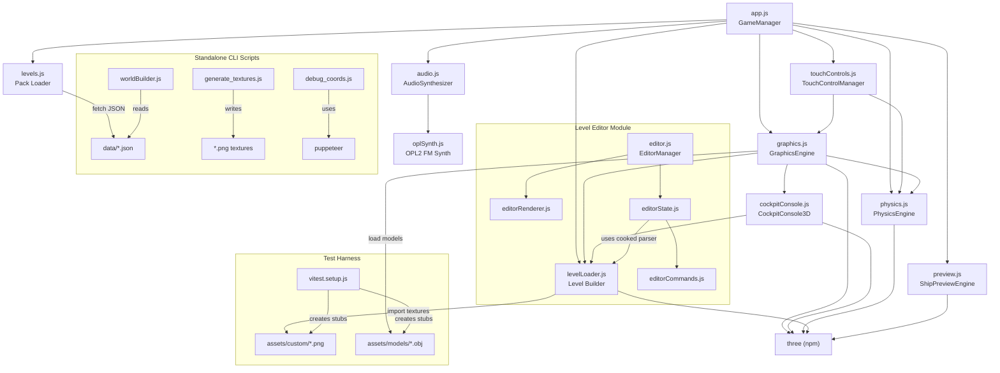

# SkyRoads WebGL — Module Map

> **Last updated:** 2026-06-06
> Authoritative code map for all source modules, their exports, dependencies, and relationships.

---

## Table of Contents

1. [Summary Table](#summary-table)
2. [app.js — Game Orchestrator](#appjs)
3. [graphics.js — Rendering Engine](#graphicsjs)
4. [physics.js — Physics & Controls](#physicsjs)
5. [levelLoader.js — Level Builder](#levelloaderjs)
6. [worldBuilder.js — Procedural Generator](#worldbuilderjs)
7. [audio.js — Audio System](#audiojs)
8. [cockpitConsole.js — Cockpit HUD](#cockpitconsolejs)
9. [preview.js — Garage Preview](#previewjs)
10. [oplSynth.js — OPL2 FM Synth](#oplsynthjs)
11. [levels.js — Level Pack Loader](#levelsjs)
12. [touchControls.js — Touch Input Manager](#touchcontrolsjs)
13. [generate_textures.js — Texture Generator](#generate_texturesjs)
14. [debug_coords.js — Debug Overlay](#debug_coordsjs)
15. [vitest.setup.js — Test Setup](#vitestsetupjs)
16. [index.html — UI Structure](#indexhtml)
17. [index.css — Design System](#indexcss)
18. [vite.config.js — Build Config](#viteconfigjs)
19. [package.json — Project Metadata](#packagejson)
20. [editor.html — Editor UI Structure](#editorhtml-1)
21. [editor.css — Editor Design System](#editorcss-1)
22. [editor.js — Editor Manager](#editorjs-1)
23. [editorRenderer.js — Editor Viewport Renderer](#editorrendererjs-1)
24. [editorState.js — Editor Document State](#editorstatejs-1)
25. [editorCommands.js — Editor Commands](#editorcommandsjs-1)
26. [Cross-Module Dependency Graph](#cross-module-dependency-graph)
27. [Theme System](#theme-system)
28. [Asset Structure](#asset-structure)
29. [Data Files](#data-files)

---

## Summary Table

| File | Size | Lines (approx) | Purpose |
|------|------|-----------------|---------|
| [app.js](../app.js) | 111 KB | ~2,797 | GameManager — state machine, UI, game loop, input, garage, settings |
| [graphics.js](../graphics.js) | 93 KB | ~1,800 | Three.js rendering, particles, skybox, theming, ship models |
| [levelLoader.js](../levelLoader.js) | 88 KB | ~2,200 | Level geometry builder, themed textures, async building |
| [index.css](../index.css) | 78 KB | ~3,145 | Retro-futuristic glassmorphism design system |
| [editor.js](../editor.js) | 65 KB | ~1,600 | Level Editor — page orchestrator, UI listeners, customizer |
| [index.html](../index.html) | 61 KB | ~967 | Full game UI — menus, HUD, settings, garage, touch controls |
| [worldBuilder.js](../worldBuilder.js) | 50 KB | ~1,695 | Procedural level generation (standalone Node.js CLI) |
| [physics.js](../physics.js) | 46 KB | ~1,050 | Physics engine, collision detection, keyboard/gamepad controller |
| [audio.js](../audio.js) | 41 KB | ~1,281 | Web Audio API synthesizer, music sequencer, SFX |
| [editorRenderer.js](../editorRenderer.js) | 35 KB | ~900 | 3D + 2D orthogonal camera layout viewports renderer |
| [cockpitConsole.js](../cockpitConsole.js) | 35 KB | ~400 | 3D cockpit dashboard HUD + path scanner minimap |
| [editor.html](../editor.html) | 27 KB | ~750 | Editor UI Structure — viewport layouts, controls sidebar |
| [editor.css](../editor.css) | 25 KB | ~850 | Editor Design System — glassmorphic sidebar, multi-viewport split |
| [touchControls.js](../touchControls.js) | 24 KB | ~752 | Touch input manager — individual button system |
| [preview.js](../preview.js) | 23 KB | ~600 | Ship garage preview engine (isolated Three.js scene) |
| [oplSynth.js](../oplSynth.js) | 19 KB | ~637 | OPL2 FM synthesis (Yamaha YM3812) + LZS decompressor |
| [generate_textures.js](../generate_textures.js) | 18 KB | ~511 | Procedural PNG texture generator (standalone Node.js) |
| [editorState.js](../editorState.js) | 17 KB | ~450 | Editor document state, undo/redo manager, level translation |
| [debug_coords.js](../debug_coords.js) | 7 KB | ~220 | Puppeteer-based UI debug automation script |
| [editorCommands.js](../editorCommands.js) | 6 KB | ~200 | Drawing, Fill, Marquee and Resize command implementations |
| [levels.js](../levels.js) | 2 KB | ~78 | Level pack fetch + cache loader |
| [vitest.setup.js](../vitest.setup.js) | 4 KB | ~103 | Test harness — asset stub generation + Python runners |
| [vite.config.js](../vite.config.js) | <1 KB | ~20 | Build + test configuration |

---

## app.js

**Purpose:** Central GameManager singleton that wires together all subsystems. Manages the game state machine, all UI events, localStorage persistence, input modes (keyboard, gamepad, touch, mouse), scoring, ship garage, physics calibrator, and the main requestAnimationFrame game loop.

**Stats:** ~2,797 lines · 111 KB

**Exports:** None (side-effect module — instantiates `GameManager` and attaches to `window.gameManagerInstance`)

| Symbol | Type | Description |
|--------|------|-------------|
| `GameManager` | class | Core orchestrator singleton |
| `GameManager.states` | enum | `menu`, `levelSelect`, `loading`, `playing`, `paused`, `dead`, `success` |
| `GameManager.initGame()` | method | Bootstrap: Three.js, physics, audio, UI event listeners |
| `GameManager.gameLoop(ts)` | method | rAF loop: physics update, render, input processing |
| `GameManager.showMainMenu()` | method | Main menu with animated starfield |
| `GameManager.showLevelSelect()` | method | Level/world grid with progress indicators |
| `GameManager.showGarage()` | method | Ship garage: model/texture/color picker, class presets, cockpit preview |
| `GameManager.showSettings()` | method | Settings: audio, controls, display, physics presets |
| `GameManager.startLevel(w, l)` | method | Loads and starts a specific level |
| `GameManager.saveGameState()` | method | LocalStorage persistence: progress, settings, ship config |
| `GameManager.loadGameState()` | method | Restores state from localStorage |
| `GameManager.toggleFullscreen()` | method | Fullscreen API toggle |
| `GameManager.updateAutoLaneSnap()` | method | Autolane snapping toggle + strength slider |
| `GamepadManager` | class (internal) | Xbox/generic gamepad polling, button mapping, deadzone config |
| `SKIN_DETAILS` | const object | Display names and descriptions for ship skins |

**Dependencies:**
- [levels.js](../levels.js) → `loadLevelPack`, `getCachedPack`
- [graphics.js](../graphics.js) → `GraphicsEngine`
- [physics.js](../physics.js) → `PhysicsEngine`, `KeyboardController`, `SHIP_LENGTH`
- [levelLoader.js](../levelLoader.js) → `buildLevelAsync`, `disposeUnusedThemes`, `getActiveThemeIndex`
- [audio.js](../audio.js) → `gameAudio`
- [preview.js](../preview.js) → `ShipPreviewEngine`
- [touchControls.js](../touchControls.js) → `TouchControlManager`
- `three` (npm)

---

## graphics.js

**Purpose:** Three.js-based rendering pipeline. Manages 3D scene, camera, lighting, skybox shader, ship model loading (OBJ/FBX/GLB), skin texture painting, cockpit overlay, particle effects (exhaust, explosions, sparks), and camera modes (Fixed, Chase, Cockpit, Free).

**Stats:** ~1,800 lines · 93 KB

| Symbol | Type | Description |
|--------|------|-------------|
| `GraphicsEngine` | class | Main rendering engine |
| `GraphicsEngine.constructor(container)` | method | Creates scene, renderer, camera, lights, skybox |
| `GraphicsEngine.loadShipModel(model, skin, accent)` | method | Loads 3D ship with texture + accent color |
| `GraphicsEngine.paintShipAccent(color)` | method | Dynamic accent overlay via canvas |
| `GraphicsEngine.update(physicsState, dt)` | method | Updates camera, ship position/rotation, particles, cockpit |
| `GraphicsEngine.setCameraMode(mode)` | method | Fixed / Chase / Cockpit / Free |
| `GraphicsEngine.cycleCamera()` | method | Cycles through camera modes |
| `GraphicsEngine.setZoom(level)` | method | Near / Med / Far |
| `GraphicsEngine.createExplosionParticles()` | method | Death explosion effect |
| `GraphicsEngine.dispose()` | method | Cleanup GPU resources |
| `SHIP_MODELS` | const object | Model catalog: fighter, hauler, scout, dreadnought, cruiser, racer |
| `SHIP_SKINS` | const object | Skin texture catalog: default, freelancer, lordshadow, psionic, shadee, thor |
| `SHIP_METRICS` | const object | Per-model scale/offset positioning metrics |
| `BASE_TEXTURES` | const object | Named texture presets (hull, road, skins) |
| `LEGACY_MODEL_ALIASES` | const object | Legacy model name → current model mappings |

**Dependencies:**
- `three` (+ OBJLoader, FBXLoader, GLTFLoader)
- [physics.js](../physics.js) → `SHIP_WIDTH`, `SHIP_HEIGHT`, `SHIP_LENGTH`
- [cockpitConsole.js](../cockpitConsole.js) → `CockpitConsole3D`
- [levelLoader.js](../levelLoader.js) → `getLevelObjUrl`, `getLevelAssetUrl`, `getActiveThemeIndex`, `THEMES`
- Static assets: ship textures (`.jpg`), hull/road textures (`.png`), cockpit images (`.jfif`), skybox GLTF

---

## physics.js

**Purpose:** Kinematics engine for ship movement, gravity, jumping (coyote time, variable jump, asymmetric fall gravity), AABB collision detection with ramp height interpolation, wall rebounds, tile effects, and ship class presets. Also contains the `KeyboardController` for keyboard + gamepad input.

**Stats:** ~850 lines · 42 KB

| Symbol | Type | Description |
|--------|------|-------------|
| `PhysicsEngine` | class | Main physics simulation |
| `PhysicsEngine.constructor(levelData, config)` | method | Initializes from calibration config |
| `PhysicsEngine.update(dt, inputs)` | method | Throttle, steering, gravity, jump, collision, tile effects |
| `PhysicsEngine.getState()` | method | Returns position, velocity, speed, grounded, oxygen, fuel, progress |
| `PhysicsEngine.checkCollisions()` | method | AABB collision with ramp height interpolation |
| `PhysicsEngine.applyTileEffects()` | method | Boost, sticky, slippery, explosive, refill |
| `PhysicsEngine.jump()` | method | Variable-height jump with coyote time buffer |
| `PhysicsEngine.reset()` | method | Reset to start position |
| `KeyboardController` | class | Keyboard + gamepad input handler |
| `KeyboardController.getInputs()` | method | Returns `{ forward, backward, left, right, jump }` |
| `KeyboardController.setGamepadMapping(m)` | method | Configure gamepad button bindings |
| `KeyboardController.pollGamepad()` | method | Reads Gamepad API state |
| `CLASS_PRESETS` | const object | VGA Classic, Modern Snappy, Lunar Float, Custom Slot |
| `ROAD_WIDTH_LANES` | const `7` | Number of lanes |
| `TILE_WIDTH` | const `2.0` | Width of one road tile (m) |
| `TILE_LENGTH` | const `4.0` | Length of one road tile (m) |
| `TOTAL_ROAD_WIDTH` | const `14.0` | Total road width |
| `SHIP_WIDTH` | const `0.6` | Ship collision box width |
| `SHIP_HEIGHT` | const `0.4` | Ship collision box height |
| `SHIP_LENGTH` | const `1.8` | Ship collision box length |

**Dependencies:**
- `three` (Vector3, Box3)

---

## levelLoader.js

**Purpose:** Transforms level JSON data structures into Three.js 3D geometry. Handles themed texture loading across 14 themes, decal overlays, dynamic UV mapping for non-uniform blocks, tunnel archway placement, ramp geometry, and progressive async building with progress callbacks. Also manages texture caching and VRAM disposal.

**Stats:** ~2,200 lines · 88 KB

| Symbol | Type | Description |
|--------|------|-------------|
| `buildLevel(levelData, scene, zOffset, isInfinite)` | function | Synchronous level geometry builder |
| `buildLevelAsync(levelData, scene, onProgress, zOffset, isInfinite)` | function | Async level builder with progress callback |
| `disposeUnusedThemes(activeThemeIndex)` | function | Disposes GPU textures for inactive themes |
| `getActiveThemeIndex(levelData)` | function | Determines which theme for a level |
| `getCustomAssetUrl(filename)` | function | Resolves custom asset path via import.meta.glob |
| `getLevelAssetUrl(levelIndex, filename)` | function | Resolves per-level custom asset URL |
| `getLevelObjUrl(levelIndex, filename)` | function | Resolves per-level OBJ model URL |
| `THEMES` | const array | 4 theme definitions with all texture URLs |
| `textureCache` | Map | Primary loaded texture cache |
| `loadedTextureCache` | Map | Secondary theme texture cache |
| `TILE_WIDTH` | const `2.0` | Road tile width (redeclared) |
| `TILE_LENGTH` | const `4.0` | Road tile length (redeclared) |
| `ROAD_WIDTH_LANES` | const `7` | Lane count |
| `TOTAL_ROAD_WIDTH` | const `14.0` | Total road width |

**Dependencies:**
- `three` (+ `RoundedBoxGeometry` addon)
- ~60+ static asset imports (themed textures via Vite static imports)
- `import.meta.glob` for dynamic custom asset discovery

---

## worldBuilder.js

**Purpose:** Standalone Node.js CLI script that procedurally generates 30 playable levels across 10 biomes. Uses seeded PRNG (Mulberry32), pattern-based construction from `level_patterns.json`, and a static physics solver to verify each level is fully traversable before accepting it. Outputs `data/generated_levels.json`.

**Stats:** ~1,695 lines · 50 KB

| Symbol | Type | Description |
|--------|------|-------------|
| `createRng(seed)` | function (internal) | Seeded Mulberry32 PRNG |
| `generateLevelData(idx, biome, seed)` | function (internal) | Creates level data structure |
| `solveLevel(levelData)` | function (internal) | Static physics simulation to verify completability |
| `BIOME_PALETTES` | const (internal) | 10 biome × color scheme mappings |

**Exports:** None (standalone script, not imported by other modules)

**Dependencies:**
- `fs`, `path` (Node.js builtins)
- [data/level_patterns.json](../data/level_patterns.json) (loaded at startup)

---

## audio.js

**Purpose:** Web Audio API wrapper providing both a custom retro synthesizer (procedural SFX: engine hum, boost, jump, explosion, landing) and integration with the OPL2 FM synthesizer for authentic 1993 SkyRoads music playback. Manages AudioContext lifecycle, volume control, track selection, and test environment detection.

**Stats:** ~1,281 lines · 41 KB

| Symbol | Type | Description |
|--------|------|-------------|
| `gameAudio` | const `AudioSynthesizer` | Singleton audio manager instance |
| `.init()` | method | Creates AudioContext on first user interaction |
| `.playEngineHum(speed)` | method | Continuous engine sound |
| `.playSfx(name)` | method | Trigger named SFX (boost, jump, crash, land, etc.) |
| `.startMusic(trackIndex)` | method | OPL2 music playback |
| `.stopMusic()` | method | Stops current track |
| `.setMusicVolume(v)` | method | Music volume (0–1) |
| `.setSfxVolume(v)` | method | SFX volume (0–1) |
| `.setSoundMode(mode)` | method | Toggle 'synth' vs 'opl' modes |
| `.nextTrack()` | method | Cycle available music tracks |

**Dependencies:**
- [oplSynth.js](../oplSynth.js) → `muzaxUrl`, `sfxUrl`, `introUrl`, `parseMuzax`, `parseSfx`, `OplSynthJS`, `MuzaxPlayerJS`

---

## cockpitConsole.js

**Purpose:** Provides a 2D path scanner minimap (rendered to canvas, showing upcoming road layout) and a 3D cockpit console object placed in the Three.js scene during first-person cockpit camera mode. Includes gauge needles, LCD readouts, and themed materials.

**Stats:** ~400 lines · 35 KB

| Symbol | Type | Description |
|--------|------|-------------|
| `PathScannerMinimap` | class | 2D canvas minimap showing upcoming road tiles |
| `PathScannerMinimap.update(levelData, shipZ, shipX)` | method | Redraws minimap based on position |
| `PathScannerMinimap.setTheme(themeIndex)` | method | Color scheme matching level theme |
| `CockpitConsole3D` | class | 3D mesh group for cockpit interior dashboard |
| `CockpitConsole3D.update(physicsState)` | method | Animates gauge needles, LCD readouts |
| `CockpitConsole3D.setVisible(visible)` | method | Toggle with camera mode |

**Dependencies:**
- `three`
- [levelLoader.js](../levelLoader.js) → `TILE_WIDTH`, `TILE_LENGTH`, `ROAD_WIDTH_LANES`, `TOTAL_ROAD_WIDTH`

---

## preview.js

**Purpose:** Isolated Three.js scene for the "Hovercraft Garage" ship picker UI. Renders a rotating 3D preview of the selected ship model with chosen skin and accent color. Shares model/skin catalogs with `graphics.js` (duplicated constants — refactoring target).

**Stats:** ~600 lines · 23 KB

| Symbol | Type | Description |
|--------|------|-------------|
| `ShipPreviewEngine` | class | Preview renderer |
| `.constructor(container)` | method | Creates isolated scene, camera, lights |
| `.loadModel(model, skin, accent)` | method | Loads and displays ship |
| `.setAccentColor(color)` | method | Repaint accent overlay |
| `.setSkin(skinName)` | method | Switch base skin texture |
| `.startRotation()` / `.stopRotation()` | methods | Auto-rotate animation |
| `.dispose()` | method | Cleanup GPU resources |
| `SHIP_MODELS` | const object | Model catalog (duplicated from graphics.js) |
| `SHIP_SKINS` | const object | Skin catalog (duplicated from graphics.js) |
| `SHIP_METRICS` | const object | Positioning metrics (duplicated from graphics.js) |
| `BASE_TEXTURES` | const object | Texture presets (duplicated from graphics.js) |
| `LEGACY_MODEL_ALIASES` | const object | Legacy mappings (duplicated from graphics.js) |

**Dependencies:**
- `three` (+ OBJLoader, FBXLoader, GLTFLoader)
- Ship model GLB files, skin texture JPGs

> **Note:** 5 constant objects are duplicated between `preview.js` and `graphics.js`. These should be extracted to a shared `shipCatalog.js` module.

---

## oplSynth.js

**Purpose:** Faithful JavaScript emulation of the Yamaha OPL2 (AdLib FM) sound chip used in the 1993 DOS SkyRoads. Includes LZS decompression for original compressed music data (`MUZAX.LZS`), binary SFX parsing (`SFX.SND`), and a complete FM synthesis engine with ADSR envelopes, 8 waveforms, feedback modulation, and a song sequencer.

**Stats:** ~637 lines · 19 KB

| Symbol | Type | Description |
|--------|------|-------------|
| `muzaxUrl` | string | URL to MUZAX.LZS asset |
| `sfxUrl` | string | URL to SFX.SND asset |
| `introUrl` | string | URL to INTRO.SND asset |
| `decompressStream(data, offset, size, widths)` | function | LZS bitstream decompressor |
| `parseMuzax(data)` | function | Parses MUZAX.LZS into song objects |
| `parseSfx(data)` | function | Parses SFX.SND into effect arrays |
| `OplSynthJS` | class | OPL2 FM synthesis (15 channels, ADSR, 8 waveforms) |
| `OplSynthJS.setChannelConfig(ch, inst)` | method | Configure operator A/B |
| `OplSynthJS.startNote(ch, freq, block)` | method | Trigger note |
| `OplSynthJS.stopNote(ch)` | method | Release note |
| `OplSynthJS.nextSample()` | method | Generates one audio sample |
| `MuzaxPlayerJS` | class | Song sequencer/player |
| `MuzaxPlayerJS.loadSong(idx, synth)` | method | Load and start a song |
| `MuzaxPlayerJS.render(synth, buf, rate)` | method | Fill audio buffer |

**Dependencies:**
- `MUZAX.LZS`, `SFX.SND`, `INTRO.SND` (original DOS game binary assets via Vite `?url`)

---

## levels.js

**Purpose:** Fetches and caches level pack JSON files. The "standard" pack merges standard + xmas levels with re-indexed indices. Provides sync access to already-loaded packs.

**Stats:** ~78 lines · 2 KB

| Symbol | Type | Description |
|--------|------|-------------|
| `loadLevelPack(packName)` | async function | Fetches and caches a level pack ('standard', 'xmas', 'generated') |
| `getCachedPack(packName)` | function | Synchronous access to loaded pack |
| `LEVEL_PACKS` | const object | Internal pack cache reference |

**Dependencies:**
- [data/standard_levels.json](../data/standard_levels.json) (via Vite `?url`)
- [data/xmas_levels.json](../data/xmas_levels.json) (via Vite `?url`)
- [data/generated_levels.json](../data/generated_levels.json) (via Vite `?url`)

---

## touchControls.js

**Purpose:** Extracted touch input module providing individually-positionable HUD buttons with tight bounding boxes. Replaces the old container-based touch controls that were inline in app.js. Each button uses an anchor-based positioning system (bl/br/tl/tr/tc + offset) for viewport-independent layout. Includes a customizer mode where buttons can be individually dragged to reposition, with all other buttons isolated (no accidental inputs). Config is versioned and persisted to localStorage.

**Stats:** ~752 lines · 24 KB

| Symbol | Type | Description |
|--------|------|-------------|
| `TouchControlManager` | class | Touch HUD manager |
| `.init(keyboard, graphics, app)` | method | Wire up DOM buttons, load config, bind events |
| `.show()` / `.hide()` | methods | Toggle touch HUD visibility |
| `.loadConfig()` | method | Load from localStorage (`skyroads_touch_v2`, version 2) |
| `.saveConfig()` | method | Persist to localStorage |
| `.resetConfig()` | method | Restore factory defaults |
| `.applyConfig()` | method | Position all buttons using anchor math |
| `.anchorToCSS(anchor, x, y, w, h)` | method | Convert anchor-relative coords to CSS left/top |
| `.cssToAnchor(anchor, left, top, w, h)` | method | Inverse: CSS left/top → anchor coords |
| `.bindGameEvents()` | method | Wire physics-state buttons + UI-action buttons |
| `.bindJoystick()` | method | Analogue joystick with 0.15 deadzone, pointer capture |
| `.enterCustomizeMode()` | method | Show overlay, make buttons draggable |
| `.exitCustomizeMode()` | method | Save config, restore normal input |
| `.makeButtonDraggable(id, el)` | method | Per-button drag-to-reposition with isolation |
| `STORAGE_KEY` | const `'skyroads_touch_v2'` | LocalStorage key |
| `CONFIG_VERSION` | const `2` | Schema version |
| `JOYSTICK_DEADZONE` | const `0.15` | Analogue stick dead zone |

**DOM Elements Expected:**
- `#mobile-touch-hud` — Container overlay
- `#touch-btn-pause`, `#touch-btn-edit` — Top bar controls
- `#touch-btn-cam`, `#touch-btn-curve`, `#touch-btn-zoom-in`, `#touch-btn-zoom-out` — Camera cluster
- `#touch-btn-rewind` — Rewind button
- `#touch-btn-steer`, `#joystick-base`, `#joystick-knob` — Joystick
- `#touch-dpad-view` + `.dpad-btn` — D-Pad alternative
- `#touch-btn-thrust`, `#touch-btn-brake`, `#touch-btn-jump` — Action buttons
- `#touch-customizer-overlay` — Customizer toolbar

**Dependencies:**
- [physics.js](../physics.js) → `KeyboardController` (via constructor injection)
- [graphics.js](../graphics.js) → `GraphicsEngine` (via constructor injection)
- [app.js](../app.js) → `GameManager` (via constructor injection, for `toggleSettingsMenu`)

---

## generate_textures.js

**Purpose:** Standalone Node.js script that procedurally generates seamless 1024×1024 PNG textures from pure math (no image dependencies). Uses deterministic seeded PRNG (Mulberry32) and hand-rolled PNG encoding with CRC32 + zlib.

**Stats:** ~511 lines · 18 KB

| Symbol | Type | Description |
|--------|------|-------------|
| `mulberry32(seed)` | function (internal) | Seeded PRNG |
| `encodePNG(w, h, pixels)` | function (internal) | Raw PNG encoder |
| `generateRoadPlate()` | function (internal) | Generates `road_metallic_plate.png` |
| `generateSpaceshipHull()` | function (internal) | Generates `spaceship_hull_plating.png` |

**Exports:** None (standalone script, writes files directly)

**Output:**
- `road_metallic_plate.png` — dark industrial road texture
- `spaceship_hull_plating.png` — titanium hull plating texture

**Dependencies:**
- `fs`, `path`, `zlib` (Node.js builtins)

---

## debug_coords.js

**Purpose:** Puppeteer-based headless browser automation script for debugging touch HUD button coordinates and visibility. Launches Vite dev server, opens the game in headless Chrome/Edge, navigates through menus, and inspects DOM element properties.

**Stats:** ~220 lines · 7 KB

| Symbol | Type | Description |
|--------|------|-------------|
| `delay(ms)` | function (internal) | Promise-based sleep |
| `isPortOpen(port)` | function (internal) | Port checking utility |
| `terminateProcessOnPort(port)` | function (internal) | Windows-specific process killer |
| `run()` | function (internal) | Main automation flow |

**Exports:** None (standalone script)

**Dependencies:**
- `puppeteer` (headless browser)
- `child_process`, `fs`, `path`, `net` (Node.js builtins)

---

## vitest.setup.js

**Purpose:** Pre-test initialization that creates stub model files (OBJ placeholders) and texture files in `assets/models/` and `assets/custom/`, then optionally runs Python generators for real assets.

**Stats:** ~103 lines · 4 KB

**Creates stubs for:**
- 6 ship models (fighter, hauler, scout, dreadnought, cruiser, tunnel_archway) as OBJ
- 4 themes × 3 types × diffuse/normal textures
- 6 decal types × (base + per-theme variants)

**Dependencies:**
- `child_process`, `fs`, `path` (Node.js builtins)
- `scratch/generate_models.py` (optional)
- `scratch/generate_comfy_assets.py` (optional)

---

## index.html

**Purpose:** Main HTML document containing all UI screens, overlays, HUD, and the WebGL game canvas. Single-page application with overlay-based navigation.

**Stats:** ~967 lines · 61 KB

### Structure

| Section | Element ID | Description |
|---------|-----------|-------------|
| Canvas Container | `#canvas-container` | Three.js WebGL viewport |
| Settings Gear | `#btn-settings-gear` | Floating top-left settings button |
| Physics Calibrator | `#btn-settings-physics` | Floating calibrator button |
| Pause Button | `#btn-in-game-pause` | In-game pause trigger |
| Fullscreen Button | `#btn-fullscreen-trigger` | Top-right fullscreen toggle |
| HUD Dashboard | `#hud .cockpit-panel` | 5-column grid: progress tube, GRAV-G LCD, center speedometer (SVG gauge), JUMP-O LCD, navigation telemetry |
| Main Menu | `#screen-main-menu` | PLAY, PLAY 10 NEW WORLDS, HOW TO PLAY |
| Settings Screen | `#screen-settings` | Difficulty, audio, controls, display, gamepad config |
| Gamepad Config | `#screen-gamepad-config` | Button mapping for 7 actions |
| Physics Calibrator | `#panel-physics-cal` | 4 sections × ~20 sliders (throttle, handling, jumping, camera) |
| Level Select | `#screen-level-select` | Grid + Infinite Road button |
| Ship Garage | `#screen-ship-picker` | Preview viewport + sidebar (models, skins, accent colors) |
| Death Screen | `#screen-death` | Crash overlay |
| Success Screen | `#screen-success` | Run telemetry, scoring, leaderboard |
| How To Play | `#screen-how-to-play` | Controls guide + tile color legend |
| Loading Screen | `#screen-loading` | Spinner + progress bar |
| Mobile Touch HUD | `#mobile-touch-hud` | Individual buttons: joystick/d-pad, thrust, brake, jump, camera, rewind, curve, zoom, pause, edit/customize |

---

## index.css

**Purpose:** Complete game styling with retro-futuristic glassmorphism design system, responsive layouts, and animations.

**Stats:** ~3,145 lines · 78 KB

### Major Sections

1. **CSS Reset & Design Tokens** — `:root` variables for colors, fonts, neon shadows
2. **Viewport & Overlay** — Fullscreen canvas, glassmorphism overlay
3. **Glass Cards** — `backdrop-filter: blur(15px)` frosted panels
4. **Typography** — Orbitron display font with gradient fills
5. **Buttons** — Primary (pink gradient), secondary (cyan gradient), info (transparent)
6. **Level Grid** — 5-column responsive grid with neon hover effects
7. **Status Cards** — Win/lose screens with danger/success colors
8. **How To Play** — Key badges, control rows, color swatches
9. **Cockpit Dashboard HUD** — 5-column panel: progress tube, LCD screens, SVG speedometer, telemetry, status LEDs
10. **Loading Screen** — Spinning border animation, progress bar
11. **Credits** — GitHub link with Octocat
12. **Settings Controls** — Custom range slider styling (WebKit + Mozilla)
13. **Responsive** — `@media (max-width: 600px)` breakpoints
14. **Keyboard Navigation** — `.keyboard-focused` accessibility states
15. **Ship Garage** — Model/texture/color option cards, scrollable sidebar
16. **Cockpit Overlay** — First-person cabin bezel image
17. **Pause/Fullscreen** — Glassmorphic floating buttons
18. **Touch Controls v2** — Individual button system with anchor positioning, customizer mode, responsive breakpoints
19. **Physics Calibrator** — Floating panel with slider groups, preset buttons

---

## vite.config.js

**Stats:** ~20 lines

```js
export default defineConfig({
  base: './',
  build: { outDir: 'dist' },
  assetsInclude: ['**/*.obj'],
  test: {
    environment: 'jsdom',
    globals: true,
    setupFiles: ['./vitest.setup.js'],
    exclude: ['**/node_modules/**', '**/dist/**', '**/.agents/**']
  }
});
```

---

## package.json

**Name:** skyroads-webgl · **Type:** ES module · **Version:** 1.0.0

| Script | Command |
|--------|---------|
| `dev` | `vite` |
| `build` | `vite build` |
| `preview` | `vite preview` |
| `test` | `vitest run` |

| Dependency | Version | Purpose |
|------------|---------|---------|
| `three` | ^0.175.0 | 3D rendering engine |
| `vite` | ^6.3.5 | Build tool / dev server |
| `vitest` | ^3.1.4 | Test runner |
| `jsdom` | ^26.1.0 | DOM simulation for tests |

---

## editor.html

**Purpose:** Layout structure for the Level Editor. Splits the screen into a left-side toolbox/controls panel and a right-side multi-viewport canvas grid (3D perspective viewport + Top, Front, Side orthogonal viewports).

**DOM Elements Expected:**
- `#viewport-container` — Holds the four viewport canvas elements.
- `#editor-toolbox` — Left sidebar for presets, options, commands, and layer configs.
- `#editor-status-bar` — Bottom stats bar showing loaded levels, active tools, selection sizes, and cursor grids.

---

## editor.css

**Purpose:** Stylesheets for the Level Editor page. Provides layout constraints for the 2x2 grid container of viewports, styling for custom scrollbars, tool sliders, overlay widgets, and active state indicators for toolbox buttons.

---

## editor.js

**Purpose:** Central coordinator for the Level Editor. Exposes the `EditorManager` class which binds all document elements, runs viewport canvas resizing listeners, listens to mouse coordinate drag/drops, handles file loading/uploading dialogs, and coordinates the playtest integration mode.

**Stats:** ~1,600 lines · 65 KB

**Exports:** `EditorManager` (attached to `window.editorInstance`)

**Dependencies:**
- [editorState.js](../editorState.js) → `EditorState`
- [editorRenderer.js](../editorRenderer.js) → `EditorRenderer`
- [editorCommands.js](../editorCommands.js) → command classes (`DrawCellCommand`, `EraseCellCommand`, `FillCellsCommand`, `ResizeGridCommand`, etc.)

---

## editorRenderer.js

**Purpose:** WebGL scene manager for the Level Editor. Exposes the `EditorRenderer` class which constructs four orthographic and perspective cameras, sets up lighting, builds visual guides (helper grids, view limits, and axis lines), and transforms cell states into Three.js geometries using the system themes.

**Stats:** ~900 lines · 35 KB

**Exports:** `EditorRenderer`

**Dependencies:**
- `three`
- [levelLoader.js](../levelLoader.js) → `THEMES`, `getActiveThemeIndex`

---

## editorState.js

**Purpose:** Document model representing the active edited track. Manages current selection bounding boxes, active layer views, undo/redo stacks, and provides a translation parser between editor-native JSON files and game-cooked LZS/JSON level schemas.

**Stats:** ~450 lines · 17 KB

**Exports:** `EditorState`

**Dependencies:**
- [levelLoader.js](../levelLoader.js) → `TILE_WIDTH`, `TILE_LENGTH`

---

## editorCommands.js

**Purpose:** Standard implementation of the Command Pattern for editor mutations. Keeps undo and redo stacks clean by wrapping grid modifications (like pen drawings, fills, selections, or grid resizing) in execute/undo boundaries.

**Stats:** ~200 lines · 6 KB

**Exports:** `DrawCellCommand`, `EraseCellCommand`, `FillCellsCommand`, `ResizeGridCommand`, `SelectionCommand`

---

## Cross-Module Dependency Graph



---

## Theme System

14 visual themes, each with a complete set of road, obstacle, tunnel, and decal textures:

| Theme | Style |
|-------|-------|
| `core` | Default base theme |
| `cyberpunk` | Neon-lit futuristic city |
| `industrial` | Heavy metal, riveted panels |
| `organic` | Bio-mechanical, living surfaces |
| `alien` | Extraterrestrial, exotic materials |
| `furnace` | Volcanic, molten metal |
| `glitch` | Digital corruption, pixelated |
| `pulse` | Energy waves, electric |
| `ridge` | Rocky, mountainous terrain |
| `shallows` | Underwater, aquatic |
| `spire` | Crystal towers, glass |
| `thrill` | High-speed, racing |
| `tundra` | Frozen, icy landscape |
| `void` | Dark space, emptiness |

**Per-theme assets:**
- `{theme}_road_diffuse.png` + `{theme}_road_normal.png`
- `{theme}_obstacle_diffuse.png` + `{theme}_obstacle_normal.png`
- `{theme}_tunnel_diffuse.png` + `{theme}_tunnel_normal.png`
- `decal_{type}_{theme}.png` for each of 6 decal types

---

## Asset Structure

```
assets/
├── models/          6 OBJ ship models + tunnel_archway.obj
├── custom/
│   ├── *.glb        6 GLB ship models + tunnel_archway.glb
│   ├── *.png        ~269 themed textures + decals
│   └── level_61-90/ 30 per-level asset directories
└── *.blend          Blender source files
```

---

## Data Files

| File | Size | Description |
|------|------|-------------|
| [standard_levels.json](../data/standard_levels.json) | 3.5 MB | 31 standard levels from original DOS SkyRoads |
| [xmas_levels.json](../data/xmas_levels.json) | 2.2 MB | 31 Christmas Special levels |
| [generated_levels.json](../data/generated_levels.json) | 3.2 MB | 30 procedurally generated levels (index 61–90) |
| [level_patterns.json](../data/level_patterns.json) | 52 KB | Extracted statistical patterns from original levels |
