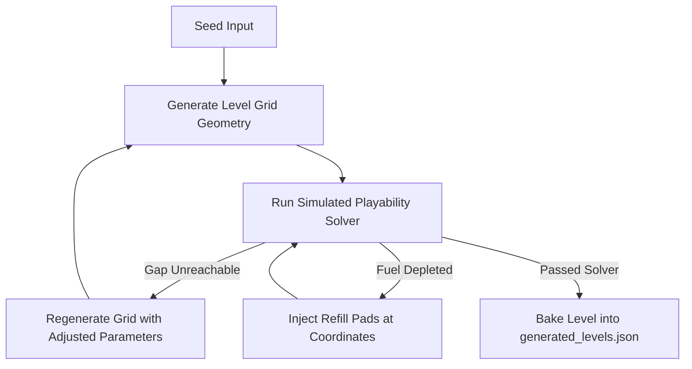

# AI Council Assessment & Expanded Implementation Design

This document details the evaluation and recommendations of the four-voice AI decision council regarding the **10 Generated Worlds & World Builder** expansion for the SkyRoads WebGL Remake. It outlines a unified strategy that addresses playability, performance, browser compatibility, and visual quality.

---

## 1. The Decision Council Panel

We convened the council to assess the structural design of the procedural level generator, visual theme integration, and resource constraints:

### **Architect** (In-Context Gemini Voice)
*   **Position:** Build-time bake the level definitions into a static, validated JSON schema (`data/generated_levels.json`) generated by a Node.js script. This enforces strict mathematical playability validation (verifying jump distances and fuel consumption profiles) via a solver before ship placement, while separating asset bundle metadata from runtime generator logic.
*   **Reasoning:** Static baking guarantees 100% playable levels, prevents cross-browser float calculation drift (Safari vs. Chrome), and keeps the runtime bundle lightweight.

### **Skeptic** (Subagent `ad3cbbaa-4f83-4381-a1e9-2f5f49cc9b62`)
*   **Position:** Reject runtime client-side generation in favor of build-time level baking/validation, and enforce strict single-biome asset pooling. Procedural pathing without static solver checks will inevitably generate unplayable levels.
*   **Reasoning:** Points out that without static checks, level playability cannot be guaranteed; warns that loading 10 biomes concurrently will crash low-end mobile WebGL; notes that simple Pillow fallbacks will break the depth illusion of normal shaders.

### **Pragmatist** (Subagent `311c8b04-e0d8-41ce-b3ea-cb4e5a665724`)
*   **Position:** Build a simple grid-to-coordinate mapping generator in `worldBuilder.js` utilizing static level definitions (seed + parameter presets) parsed on level load, and defer complex procedural visual variations to post-MVP. Keep visual quality high by mapping pre-generated texture assets to simple biome-specific materials rather than generating runtime shaders.
*   **Reasoning:** Prioritizes development speed; suggests a simple virtual runner for fast mathematical jump checking; minimizes UI code changes by swapping level definition arrays in the menu.

### **Critic** (Subagent `7c111cb6-790c-44f1-a9f1-32a8fc8e0053`)
*   **Position:** Procedural level generation should be run as a build-time script that outputs static, validated JSON level definitions rather than generating levels at runtime. This guarantees 100% playability, eliminates runtime RNG overhead, and decouples visual assets from generation logic.
*   **Reasoning:** Highlights that JavaScript's `mulberry32` float calculations drift across engines (V8 in Chrome vs. JavaScriptCore in Safari), scrambling seeded paths; supports pre-baking for static preloading manifests.

---

## 2. Synthesized Verdict & Key Reconciliations

### Verdict
*   **Consensus:** **Shift completely from runtime generation to build-time level baking.** The level builder (`worldBuilder.js`) will run as a build step, outputting a static JSON map pack. This guarantees identical track geometry on all devices and enables automated path solver validation.
*   **Strongest Dissent (Visual Depth vs. Fallback):** The Skeptic identified a major risk: Pillow fallback textures will lack high-contrast relief/bevel features, breaking the normal-mapped Three.js depth illusion and making track geometry look flat. 
    *   *Resolution:* Expand the Pillow generator to draw high-contrast, multi-shaded noise, cracks, and borders, matching the depth of AI textures.
*   **Memory Optimization (Theme Thrashing):** The Critic and Skeptic warned of WebGL VRAM crashes if all 10 biomes are loaded.
    *   *Resolution:* Implement strict material garbage collection in `levelLoader.js` to load only the current level's assets and dispose of previous biome maps during state transitions.

---

## 3. Expanded Technical Specifications

Based on the council's feedback, the following detail expansions are integrated into the implementation plan:

### A. The Build-Time Playability Solver (`worldBuilder.js`)
To guarantee that every generated level is winnable, the build-time solver will run a simulated ship runner checking:
1.  **Parabolic Jump Equations:** For every gap of length $G$ (rows), check the ship's entrance velocity $v_z$ and level gravity $g$:
    $$\text{Time to Cross } (t) = \frac{G \times \text{RowLength}}{v_z}$$
    $$\text{Required Altitude } (h) \ge \text{HeightDifference} + 0.5 \times g \times t^2$$
    If the ship's max jump height is less than $h$ at speed $v_z$, the solver fails and forces a regeneration.
2.  **Fuel Consumption Verification:**
    $$\text{Fuel Used} = \sum (\text{Distance} \times \text{BurnRate}) - \sum (\text{RefillValue})$$
    If simulated fuel reaches $\le 0$ before the finish line, the level builder dynamically injects a blue refill pad into the runway 30 rows prior to the depletion coordinate.

### B. High-Contrast Pillow Fallback Textures
To prevent the "flat shader" visual degradation highlighted by the Skeptic, the Pillow fallback generator will not output solid colors. It will construct multi-layered canvas drawings:
*   **Diffuse Maps:** Render base colors overlaid with high-contrast diagonal grid lines (cyberpunk), circuit board pathways (hardware core), or crystalline fractals (cryo tundra) using mathematical patterns.
*   **Normal Maps:** Generate matching high-contrast bump textures (embossed borders, noise vectors, and bevels) using grayscale gradients converted to normal normals ($N_x, N_y, N_z$) to ensure Three.js normal shaders pop with 3D shadows under the game's directional light sources.

### C. WebGL VRAM Garbage Collection (`levelLoader.js`)
When transitioning between levels:
1.  Locate current textures in `THREE.TextureLoader`'s cache.
2.  Call `texture.dispose()` on diffuse, normal, and decal maps of the previous theme.
3.  Dispose of corresponding `THREE.ShaderMaterial` and custom shaders.
4.  Load and compile the next biome's texture assets, keeping only **one biome's assets in GPU memory** at a time.

### D. 10 Worlds Visual Palette Expansion
The following specifications define the shader properties and palettes for the new biomes in `levelLoader.js`:

| Biome Index | Name | Emissive Hex | Roughness | Metalness | Visual Shading Style |
| :--- | :--- | :--- | :--- | :--- | :--- |
| **Theme 4** | Visualizer Void | `#ff0055` | 0.9 | 0.1 | Wireframe glowing vector grids |
| **Theme 5** | Blue Ridge Ascents | `#0088ff` | 0.6 | 0.4 | Matte topographic low-poly shades |
| **Theme 6** | Thrill Sector | `#ffaa00` | 0.2 | 0.8 | Wet reflective tarmac surfaces |
| **Theme 7** | Hardware Core | `#00ff66` | 0.4 | 0.9 | Metallic copper tracks, neon lines |
| **Theme 8** | Glitch Grid | `#ff00ff` | 0.8 | 0.2 | Flickering chromatic aberration |
| **Theme 9** | Cryo-Stasis Tundra | `#00ffff` | 0.1 | 0.9 | Frozen ice, high specularity |
| **Theme 10**| Supernova Furnace | `#ff3300` | 0.7 | 0.3 | Pulsing magma heat normal maps |
| **Theme 11**| Nebula Shallows | `#8800ff` | 0.5 | 0.5 | Thick fog density overlays |
| **Theme 12**| Quantum Spire | `#ffffff` | 0.3 | 0.7 | Stark contrast geometric surfaces |
| **Theme 13**| Kinetic Pulse | `#ffff00` | 0.4 | 0.6 | Linear gear and timing-light arrays |

### E. The Level Design Analyst Agent (Pacing & Human Feel)
To prevent generated levels from feeling chaotic or algorithmic, a specialized agent (`level-analyst`) will run an analysis script (`scratch/analyze_original_levels.js`) that processes all 61 human-designed tracks to extract core patterns and distributions.

1.  **Analysis Matrix Output (`data/level_patterns.json`):**
    *   **Tile Transition Probabilities:** Markov matrices tracking the likelihood of tile behaviors following each other (e.g., $P(\text{Boost} \to \text{Gap})$, $P(\text{Flat} \to \text{Burn})$).
    *   **Gap Statistics:** Probability distributions of jump lengths (1, 2, 3 rows) and the average runway length between jumps.
    *   **Hazard Cohesion:** Metrics on how hazards group together (e.g., length of obstacle walls, checkered pattern densities).
    *   **Lane Pacing and Pathing:** Standard deviation of path center deviations (how often the ideal line swings left or right) and lateral slalom frequency.
2.  **Seeded Random Pacing Integration:**
    *   `worldBuilder.js` will ingest `level_patterns.json` at build time.
    *   Instead of purely uniform random distributions, `mulberry32` will select tile configurations by sampling from these human-derived probability weights.
    *   This preserves human level-design pacing (building tension with obstacles, offering breathing room before a big jump, and positioning fuel pads strategically) while maintaining full seeded variability and randomness.

